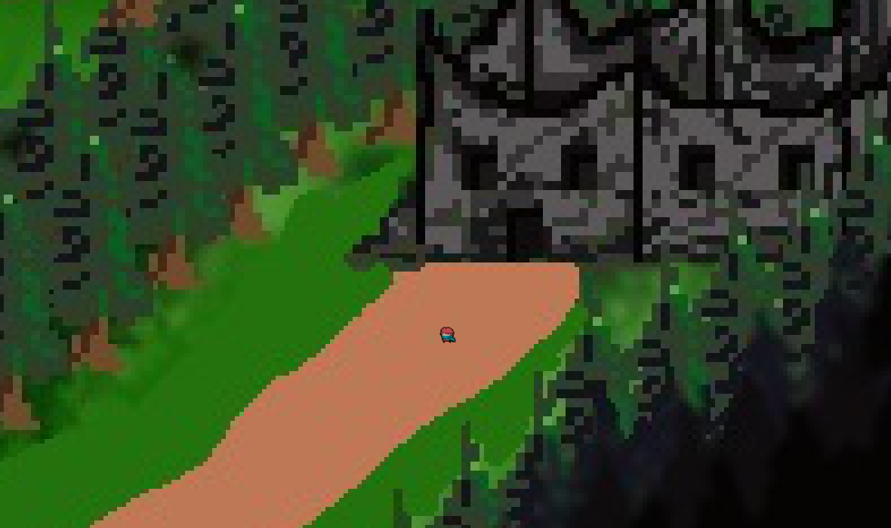

Тишина в лесу
=============

Жанр: Психологический хоррор с элементами выживания\
Движок: pygame\
Язык программирования: Python\
Цель проекта: Простая 2D-игра для погружения в атмосферу ужаса и выживания в лесу.

Описание игры
-------------

"Тишина в лесу" — это психологический хоррор с элементами выживания. Вы играете за журналиста, попавшего в таинственную деревню. Исследуйте лес, записывайте улики, ищите ресурсы, избегайте опасностей и постарайтесь узнать правду, сохранив рассудок.

Игрокам предстоит:
- Распознавать звуки, чтобы избегать сущностей.
- Погружаться в историю через записи в дневнике.

Основные механики
-----------------

1. Перемещение
 - Используй W, A, S, D для передвижения.
 - Ты можешь ходить только по определённым тропинкам (например, зелёным участкам).

2. Мини-игры
 - В лесу есть 3 загадочных места. Подойдя к ним, ты увидишь сообщение "Нажмите 'E', чтобы начать мини-игру".
 - Побеждай в мини-играх, чтобы двигаться дальше!
 - Если мини-игра уже выиграна, ты увидишь сообщение "Вы уже побеждали в этой мини-игре!".
3. Финальная игра
 - После победы во всех трёх мини-играх откроется финальная!
 - Доберись до секретного места и нажми "E", чтобы испытать себя в последнем испытании!
4. Инвентарь и дневник
 - Нажми "I", чтобы открыть инвентарь.
 - Там ты найдёшь дневник с записями, которые помогут разобраться в происходящем.

Особенности проекта
-------------------

- Простая, но стильная пиксельная графика.
- Возможность выбора разных концовок в зависимости от действий игрока.

Зависимости
-----------

Проект использует следующие библиотеки:
- pygame — для реализации графики и взаимодействия.
- json — для работы с файлами конфигурации и сохранений.

Установите зависимости перед запуском игры:
```
pip install -r requirements.txt
```

Запуск игры
-----------

1. Клонируйте репозиторий:
```
git clone https://github.com/Tereegor/SilentForest.git
cd SilentForest
```

2. Установите зависимости:
```
pip install -r requirements.txt
```

3. Запустите игру:
```
python main.py
```

Планы по разработке
-------------------

1. Этап 1: Основные механики (передвижение, ресурсы, карта).
2. Этап 2: Добавление звуковых эффектов и сущностей.
3. Этап 3: Реализация сюжета и дневника.
4. Этап 4: Тестирование и полировка.

Фотографии
----------




Сайт нашей игры
---------------
[Главная страница](https://goo.su/1xGnM)

[О самой игре](https://goo.su/t6zj)
